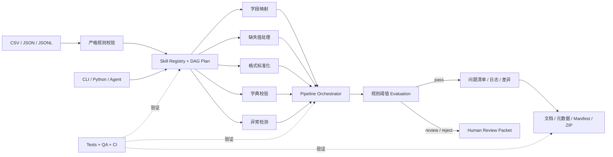

# Data Cleaning Skills

[](https://github.com/laixaviera17/data-cleaning-skills/actions/workflows/test.yml)

[](LICENSE)

一套面向数据开发与 AI 工具调用场景的规则驱动数据质量工具链。它将字段映射、缺失值处理、格式标准化、字典校验、异常检测、审计追踪和交付封装拆成独立 Skill，再通过统一接口与 Pipeline 组合执行。

项目专注于可解释、可测试的确定性数据处理，不使用生产数据，也不把规则处理包装成机器学习能力。

## 为什么需要它

真实数据清洗通常不止是调用一次 `dropna()`：处理规则需要版本化，问题行需要解释，清洗前后需要核对，最终交付还需要文档、元数据和校验和。本项目把这些环节组织成一条可复现的本地工作流，并让每个能力既可独立运行，也可被 Pipeline 或 Agent 作为工具调用。

## 2 分钟体验

```bash
git clone https://github.com/laixaviera17/data-cleaning-skills.git
cd data-cleaning-skills
python3 -m venv .venv
.venv/bin/python -m pip install '.[test]'
.venv/bin/python scripts/run_recruiter_demo.py
```

Demo 使用仓库内 16 行模拟脏数据，不访问网络、数据库或云服务。输出位于 `demo/output/`，包括清洗数据、问题清单、操作日志、差异报告、数据集文档、目录元数据和带 SHA-256 清单的 ZIP 交付包。

## 架构



包级接口位于 `src/data_cleaning_skills/`：

- `DataFrameSkill`：原子 Skill 的统一执行协议；
- `SkillResult`：统一的 DataFrame 与报告返回结构；
- `SkillRegistry`：显式注册和发现原子能力；
- `ExecutionPlan`：校验所选 Skill，并按依赖图生成确定性执行顺序；
- `DataCleaningAgent`：组合 Planner、Executor、Memory、Evaluation 与 Human Review；
- `iter_clean_csv()`：在受支持规则组合下提供内存有界的 CSV 分块处理；
- `load_workflow_tools()`：为端到端工作流提供稳定 Python 入口。

原有各模块 CLI 保持兼容，便于单独运行和逐步迁移。

## 模块

| 层级 | 模块 | 主要产出 |
| --- | --- | --- |
| 原子清洗 | `table-field-mapping-converter` | 字段映射结果与映射问题 |
| 原子清洗 | `missing-value-checker` | 缺失统计和修复结果 |
| 原子清洗 | `format-standardizer` | 日期、手机号、金额和单位标准化 |
| 原子清洗 | `field-dictionary-value-validator` | 字典修复与非法值问题 |
| 原子清洗 | `abnormal-value-detector` | 范围、枚举和正则异常 |
| 编排 | `csv-json-data-cleaning-pipeline` | 清洗数据、问题行、日志和汇总 |
| 审计 | `structured-issue-list-generator` | 统一问题清单 |
| 审计 | `cleaning-operation-log-generator` | 统一操作日志 |
| 审计 | `dataset-before-after-diff-comparator` | 清洗前后差异 |
| 交付 | `dataset-documentation-generator` | 人类可读数据集文档 |
| 交付 | `dataset-catalog-metadata-generator` | 稳定 ID 与机器可读元数据 |
| 交付 | `cleaned-dataset-delivery-packager` | Manifest、校验和与 ZIP 包 |

每个模块包含 `SKILL.md`、可运行脚本、测试和示例数据。

## 规则驱动工作流

Pipeline 会拒绝未知顶层配置，避免拼写错误或未支持配置被静默忽略。字段映射和字典校验既支持外部 CSV，也支持内联规则。

```yaml
pipeline:
  steps:
    - table-field-mapping-converter
    - missing-value-checker
    - format-standardizer
    - field-dictionary-value-validator
    - abnormal-value-detector

field_mapping:
  enabled: true
  mapping_file: "field_mapping.csv"

dictionary:
  enabled: true
  dictionary_file: "dictionary.csv"

null_handling:
  null_values: ["", "N/A", "未知"]
  strategies:
    - field: source
      action: fill
      fill_value: unknown
```

相对资源路径以规则 YAML 所在目录为基准。完整模板见 `csv-json-data-cleaning-pipeline/assets/rule_template.yaml`。
未选择的原子 Skill 会生成 `skipped` 报告；未知、重复或与已启用外部配置冲突的步骤会在执行前失败。

## Agent 与人工复核

Agent 适配层不依赖 LLM。模型可以在可信边界之外协助生成规则，但规则仍必须经过同一套校验、DAG、原子 Skill 和质量策略。

```python
from data_cleaning_skills import DataCleaningAgent, ReviewStatus, resolve_review

run = DataCleaningAgent().run(dataframe, rules)
if run.review:
    decision = resolve_review(
        run.review,
        ReviewStatus.CHANGES_REQUESTED,
        reviewer="data-owner",
        comment="Please correct the required-field mapping.",
    )
```

`SessionMemory` 只保存有界的阶段事件；`ReviewPacket` 默认只携带 `run_id`、指标、原因和复核结论，不嵌入原始业务记录。完整边界见 [`docs/architecture.md`](docs/architecture.md)。

## 输入与输出

招聘 Demo 的模拟输入包含重复主键、空值、混合日期、非法手机号、金额格式和越界值。当前预期汇总为：

| 指标 | 结果 |
| --- | ---: |
| 输入记录 | 16 |
| 输出记录 | 6 |
| 重复记录 | 2 |
| 隔离记录 | 8 |
| 问题记录 | 19 |
| 修复单元格 | 40 |

主要输出：

```text
demo/output/
├── cleaned_data.csv
├── issue_rows.csv
├── cleaning_log.csv
├── cleaning_summary.json
├── before_after_diff/
├── documentation/
├── metadata/
├── delivery_manifest.json
└── delivery/delivery_package.zip
```

Manifest 和目录元数据仅记录可移植相对标识，不嵌入用户目录等本机绝对路径。默认 `dataset_id` 由数据内容、数据集名称、版本和来源稳定生成。

## 单独运行 Pipeline

```bash
cd csv-json-data-cleaning-pipeline
../.venv/bin/python scripts/clean_dataset.py examples/sample_input.csv examples/sample_rules.yaml
```

输入支持 CSV、JSON 和 JSONL；清洗主表默认输出为 CSV，也可通过 `output.output_format` 选择 JSON 或 JSONL。各原子模块的详细规则和产物契约见对应 `SKILL.md`。

## 分块处理

对于不能一次载入内存的 CSV，可逐块消费结果：

```python
from data_cleaning_skills import iter_clean_csv

for chunk in iter_clean_csv("large.csv", rules, chunksize=50_000):
    append_to_destination(chunk.dataframe)
```

分块模式会维护跨块精确唯一键状态，但不会在内部重新拼接所有结果。为保证与整表语义一致，目前会拒绝已启用字段映射或相似度去重的规则组合。

## 测试与质量验证

```bash
.venv/bin/python qa/run_qa.py --python .venv/bin/python
```

<!-- QA_RESULTS_START -->
2026-08-04 本地全量 QA：12 个 Skill，188/188 个测试通过、0 失败、0 跳过；其中 27 个工作区集成测试。估算脚本行覆盖率为 82.3%，所有 Skill 均高于 75%。独立 `coverage.py` 分支覆盖率为 80.19%，CI 失败门禁为 75%。
<!-- QA_RESULTS_END -->

QA 包括模块测试、跨模块工作区测试和招聘 Demo 验收。覆盖率是 Python `trace` 生成的估算脚本行覆盖率，不等同于 branch coverage。

CI 在 Python 3.10、3.11 和 3.12 上运行，使用 `coverage.py` 对统一包入口执行 branch coverage，并设置 75% 的失败门禁；Ruff 与 mypy 同时检查公共接口。交付 manifest、catalog metadata、issue rows 和 cleaning log 会针对 Draft 2020-12 JSON Schema 校验实际产物。

## 性能边界

仓库提供可复现的合成数据 benchmark。2026-08-03 在 macOS arm64、Python 3.12.13 上对默认内存 Pipeline 运行 10,000 行、3 次迭代：中位耗时 2.296 秒，约 4,355 行/秒，`tracemalloc` 峰值 11.03 MiB。命令和完整机器信息见 [`benchmarks/`](benchmarks/) 与 [`docs/benchmarks/latest.json`](docs/benchmarks/latest.json)。

同一开发机上，100,000 行 CSV 使用 10,000 行 chunk 完成一次端到端读取和处理：31.295 秒，约 3,195 行/秒，处理阶段 `tracemalloc` 峰值 30.34 MiB。完整结果见 [`docs/benchmarks/latest-chunked.json`](docs/benchmarks/latest-chunked.json)。

该数字是开发机基线而非跨机器 SLA；不包含文件 I/O 和相似度去重。本项目仍定位为小到中等规模本地批处理工具链，不宣称分布式或实时生产性能。

## 项目边界

- 不连接生产数据源；所有公开样例均为本地构造数据；
- 不支持非结构化文本、图像或音频清洗；
- 不提供分布式调度、实时处理或断点续跑；
- 不使用模型预测缺失值，也不把确定性规则描述为 AI 推理；
- Agent、CLI 和 Python 调用共享同一组确定性工具接口。

## Roadmap

- [x] 原子 Skill 统一 Protocol 和 Registry；
- [x] Pipeline 接入字段映射与字典校验；
- [x] 可移植 Manifest 和稳定数据集 ID；
- [x] 删除无调用方的重复 I/O 模块并统一领域异常；
- [x] 使用 JSON Schema 验证真实交付产物；
- [x] 引入 branch coverage gate、Ruff 和 mypy；
- [x] 增加可复现的 10k 行性能与内存基准；
- [x] 增加内存有界、保持跨块精确键唯一性的 CSV 分块模式；
- [x] 增加 Planner / Executor / Memory / Evaluation / Human Review Agent 适配层；
- [x] 增加 100k 行 CSV 分块吞吐与内存基准；
- [ ] 增加 1M 行跨机器基准和相似度去重索引；
- [ ] 将剩余兼容脚本完整迁移到可独立安装的 `src` 包。

更多材料：[`架构说明`](docs/architecture.md)、[`五分钟面试讲解`](docs/interview-guide.md)、[`招聘演示`](docs/recruiter-demo.md)、[`脱敏合成业务案例`](docs/case-study.md)、[`贡献指南`](CONTRIBUTING.md) 和 [`安全策略`](SECURITY.md)。
