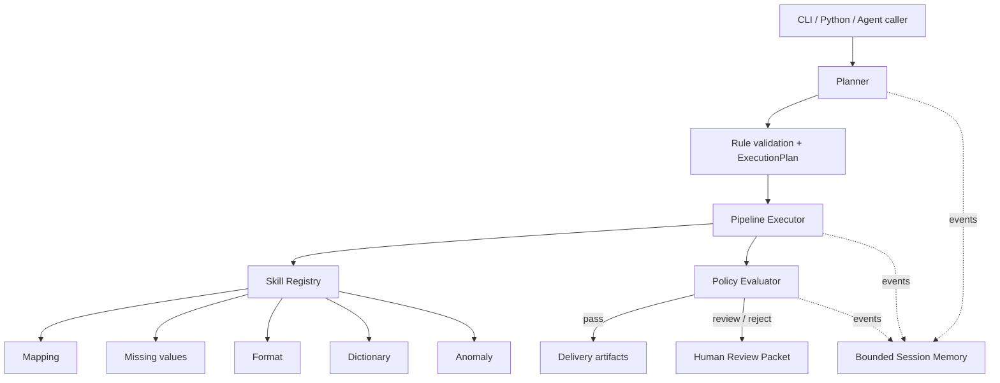

# Architecture

## System boundary

Data Cleaning Skills is a deterministic local data-quality toolkit. It accepts tabular data and explicit rules, then produces processed data and auditable artifacts. LLMs may propose a configuration, but the runtime never treats model text as trusted executable behavior.

## Layers and ownership

| Layer | Owns | Must not own |
|---|---|---|
| Atomic Skill | One deterministic DataFrame transformation and report | Pipeline order, delivery packaging, hidden network calls |
| Registry | Names, stable execution protocol, compatibility adapters | Business rule policy |
| Orchestration | Dependency order, cross-step state, issue aggregation | Reimplementation of atomic transformations |
| Evaluation | Explicit acceptance thresholds and routing decision | Data mutation or opaque model judgment |
| Human review | Reviewer identity, decision, comment, timestamp | Raw records by default |
| Delivery | Schemas, metadata, checksums, archive layout | Cleaning decisions |

## Extension path

To add an atomic Skill:

1. Define its input rules, output report, and failure behavior.
2. Implement and test the in-memory transformation without artifact writes.
3. Register an adapter that returns `SkillResult`.
4. Add dependencies to `DEFAULT_SKILL_GRAPH` only when data order requires them.
5. Add boundary, registry, Pipeline, and workspace tests.
6. Update tool metadata, documentation, and schemas when contracts change.

## Trust and privacy

- Rules are validated before file execution.
- Artifact contracts are checked with Draft 2020-12 JSON Schema.
- Review packets contain counters and reasons, not raw records.
- Manifests contain relative source identifiers rather than local absolute paths.
- Chunk processing rejects combinations whose whole-file equivalence is not implemented.

Architecture decisions with non-obvious trade-offs are recorded under `docs/adr/`.
