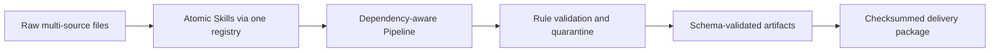

# Case study: multi-source content data delivery

> Data note: this case uses deterministic synthetic records modeled after a common content-aggregation workflow. It contains no customer or production data, and the results are evidence of repository behavior—not a claim of production deployment.

## Business problem

A data team receives CSV/JSON exports from several content portals. Field names, dates, enumerations, missing-value markers, and numeric formats differ by source. Analysts previously cleaned each file manually, which made delivery criteria inconsistent and left no reliable audit trail.

The acceptance target is a repeatable delivery package with normalized data, row-level issues, cleaning logs, before/after comparison, catalog metadata, documentation, checksums, and a manifest that another system can validate.

## Engineering approach

The implementation separates atomic transformations from orchestration. A registry normalizes each Skill to one DataFrame/result contract; the Pipeline resolves selected Skills in dependency order; YAML rules determine behavior; JSON Schema validates delivery contracts; `run_id` connects summaries and logs.

## Acceptance evidence

| Requirement | Repository evidence |
|---|---|
| Reproducible cleaning | Versioned YAML rule template and deterministic Skill plan |
| Traceability | ISO 8601 log events and one `run_id` per execution |
| Machine-readable quality findings | Standard `issue_rows.csv` plus Draft 2020-12 contract |
| Portable delivery | Relative paths, SHA-256 file inventory, stable dataset ID |
| Regression safety | Unit, boundary, workspace integration, contract, and benchmark smoke tests |
| Capacity baseline | Reproducible synthetic benchmark with runtime and memory metrics |

## What this proves—and what it does not

It proves the repository can execute a complete, contract-checked data-quality delivery workflow on controlled inputs. It does not yet prove distributed processing, production SLOs, or correctness on every industry-specific rule set. Those require representative datasets, deployment telemetry, and stakeholder acceptance tests.
